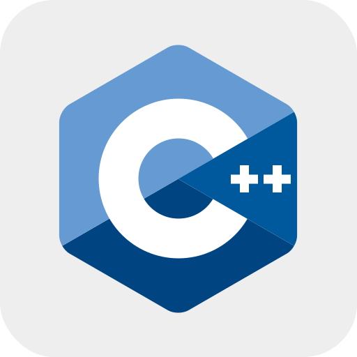

<!--  -->

## Hello, I am Nicolas Enea   

  <ul>
    <li>I’m currently working on a frontend project at Ficus Data</li>
    <li>Currently learning how to use the Vue.js framework</li>
    <li>Looking to collaborate on open source projects</li>
    <li>Looking for help with improving my activity on GitHub</li>
  </ul>

---

## Languages and Tools

 

<!--   -->

<!-- 

 -->

<!-- <kbd>
 
</kbd> -->

---
## Contact Me  

---
<!--  

 -->
 
 

 
 
